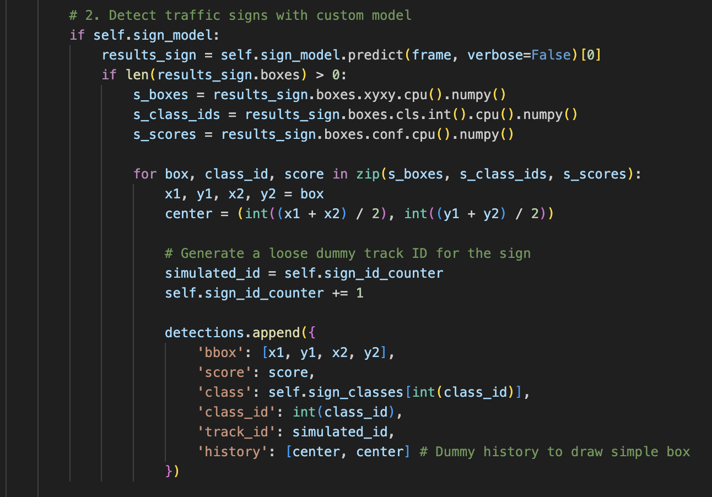
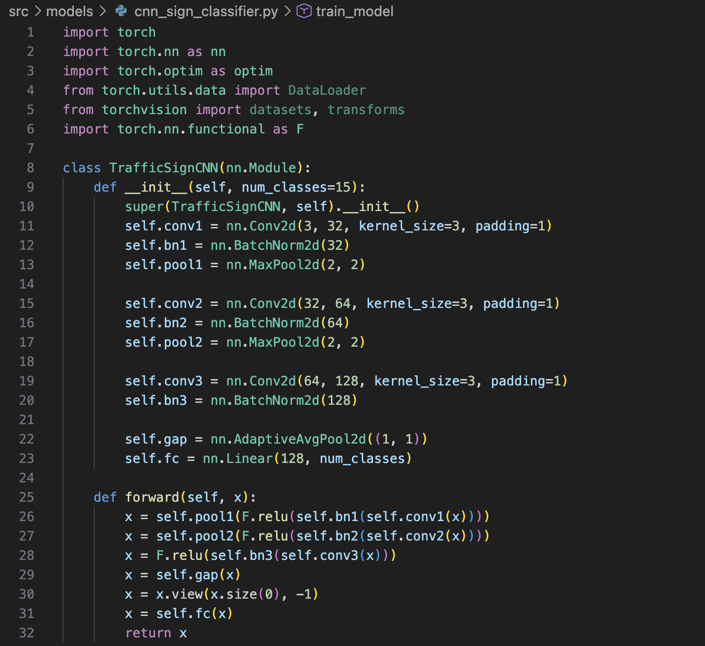
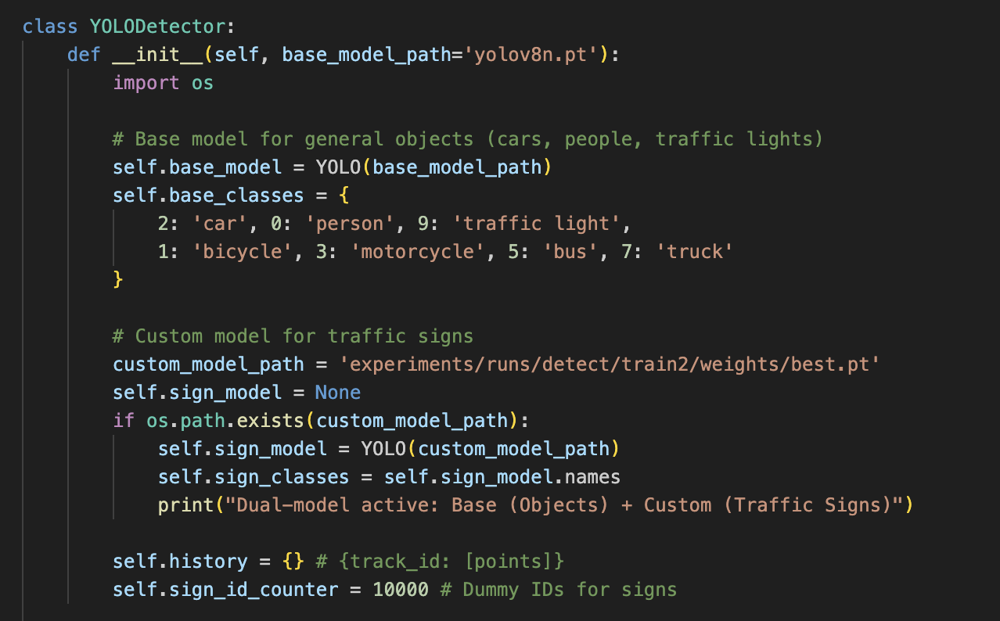

# Data Preparation & Preprocessing: IntelliAIDrive Vision Pipeline

## 1. Dataset Overview
For the visual perception component of IntelliAIDrive, we utilized the Traffic Signs Detection dataset sourced from Kaggle (`pkdarabi/cardetection`). This dataset includes a diverse set of real-world traffic sign classes (such as speed limits, stop signs, and turn directions) captured in various public road environments. Because the dataset features street signs rather than individuals, PII and human consent risks are minimized. The high variance in this dataset ensures our CNN backbone can generalize to the complex environmental states required by the RL agent.

## 2. Image Cleaning & Validation (YOLOv8n Detection)
Unlike tabular datasets, our cleaning process focused on spatial localization and filtering out low-confidence data before it reached the decision-making agent.
* **Localization & Cropping:** We utilized a fine-tuned YOLOv8n model to detect and crop only the relevant traffic signs from the broader, noisy environmental frames.
* **Confidence Filtering:** Predictions falling below our confidence threshold were filtered out to prevent passing "noisy" or incorrect visual states to the agent, which could result in critical system failures (e.g., misclassifying a speed limit as a stop sign). 

## 3. Image Transformation & Embedding (ResNet18 Feature Extractor)
To bridge the gap between raw pixel data and our Proximal Policy Optimization (PPO) agent, the localized image crops underwent strict mathematical transformations. 
1. **Resizing & Normalization:** All YOLO-cropped images were resized to uniform dimensions and normalized using standard ImageNet metrics to ensure consistent tensor shapes.
2. **Dense Vector Embedding:** Instead of standard classification, we modified a ResNet18 architecture by replacing its final classification head with an Identity layer. This preprocessing step successfully converts the raw visual crops into dense, 512-dimensional feature embeddings. This high-fidelity vector serves as the mathematically reliable observation space for the RL agent, significantly reducing computational overhead.

## 4. Label Encoding for RL Policy
The PPO reinforcement learning agent requires numeric integers to calculate optimal driving actions, not string text. 
* **Label Mapping:** We encoded the categorical text labels (e.g., "Stop", "Speed Limit") into distinct integer classes.
* **Reward Shaping Integration:** These numeric encodings are directly integrated into our custom Gymnasium environment. When the agent maps the 512-dimensional embedding to the correct encoded integer action, it receives a $+5$ reward. Incorrect mapping results in a $-3$ penalty, mathematically forcing stable policy updates over the training cycle.

